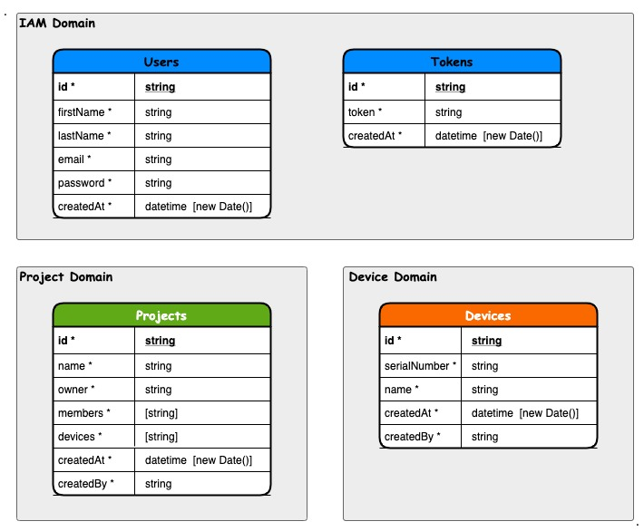

# YLZ-XYZ-INFRA

## Introduction

* This task should ideally be completed using Google or Firebase cloud platform.
* The focus is on the backend, but if possible a method to test the end point from a front end or command line would be preferred.
* The endpoint/ API calls should use Restful interface
* Good documentation should be used.


## Task

- A user signs up using the details
  * Unique Email
  * First Name
  * Surname
  * Password
- The user logs in using their email and password
  * Sign up and login should be secure on a token-based system
  * To do any functionality a secure token is required.
- The user creates a new project.  The project creator is the owner
- A user can be part of many projects
- The user can view a list of projects that are already created
- A project owner can add a registered user to a project using their email address.
- If a user is part of a project then they can access the project
- When in a project a user can add a device to the project (for this a device is a record consisting of a 5-digit serial number and a Name)
- User that have access to a project can see a list of devices.
  * A device can be part of many projects


## Optional Additional Tasks

- Use a program like “Terraform” to build the infrastructure
- A file up to 30mb can be uploaded to a project by the projects members
- The users on a project can view a list of the files and download them


## Deliverable

- Good commenting and documentation including example restful interface, and test method
- Upon completion a call will be scheduled to explore the system, thought patens, and your process.


- - -

YLZ-XYZ Project consists of the following components:
- [Infrastructure Project](https://github.com/aytekinyaliz/ylz-xyz-infra)
- [UI Project](https://github.com/aytekinyaliz/ylz-xyz-ui)
- [IAM Service](https://github.com/aytekinyaliz/ylz-xyz-iam-svc)
- [Project Service](https://github.com/aytekinyaliz/ylz-xyz-project-svc)
- [Device Service](https://github.com/aytekinyaliz/ylz-xyz-device-svc)
- [Authentication Library](https://github.com/aytekinyaliz/ylz-xyz-auth-mdw)
- [Common Library](https://github.com/aytekinyaliz/ylz-xyz-common-mdw)
  
  





## Current Topology


- Create 1 project in Firebase:  
  We are using Google Cloud Firebase technology for Database, Storage and Authentication.

  * Create service accounts and generate private key (ideally these credentials should be stored in secrets and injected into environment variables via CI pipeline. At the moment they are stored in .env files in the repo for demo purposes).
  * Create Cloud Firestore for each project (eur3 (europe-west))

## How to run locally (needs Node.js)

- Create a new folder:
  ```
  $ mkdir ylz-infra
  $ cd ylz-infra
  ```

- Clone repositories:
  ```
  $ git clone https://github.com/aytekinyaliz/ylz-xyz-ui.git
  $ git clone https://github.com/aytekinyaliz/ylz-xyz-iam-svc.git
  $ git clone https://github.com/aytekinyaliz/ylz-xyz-project-svc.git
  $ git clone https://github.com/aytekinyaliz/ylz-xyz-device-svc.git
  $ git clone https://github.com/aytekinyaliz/ylz-xyz-file-svc.git
  ```

- Install dependencies in each folder
  ```
  $ cd ylz-xyz-ui
  $ cd ylz-xyz-iam-svc
  $ cd ylz-xyz-project-svc
  $ cd ylz-xyz-device-svc
  $ cd ylz-xyz-file-svc

  $ npm install
  ```

- Run applications:
  ```
  $ cd ylz-xyz-ui
  $ cd ylz-xyz-iam-svc
  $ cd ylz-xyz-project-svc
  $ cd ylz-xyz-device-svc
  $ cd ylz-xyz-file-svc

  $ npm start
  ```

- Navigate to UI application:  
  http://localhost:2000

## How to run locally with Docker (needs Docker)

- Create a new folder:
  ```
  $ mkdir ylz-infra
  $ cd ylz-infra
  ```

- Clone repositories:
  ```
  $ git clone https://github.com/aytekinyaliz/ylz-xyz-infra.git
  $ git clone https://github.com/aytekinyaliz/ylz-xyz-ui.git
  $ git clone https://github.com/aytekinyaliz/ylz-xyz-iam-svc.git
  $ git clone https://github.com/aytekinyaliz/ylz-xyz-project-svc.git
  $ git clone https://github.com/aytekinyaliz/ylz-xyz-device-svc.git
  $ git clone https://github.com/aytekinyaliz/ylz-xyz-file-svc.git
  ```

- Build docker files:
  ```
  $ cd ylz-xyz-ui
    docker build -t ylz-xyz-ui .
  $ cd ylz-xyz-iam-svc
    docker build -t ylz-xyz-iam-svc .
  $ cd ylz-xyz-project-svc
    docker build -t ylz-xyz-project-svc .
  $ cd ylz-xyz-device-svc
    docker build -t ylz-xyz-device-svc .
  $ cd ylz-xyz-file-svc
    docker build -t ylz-xyz-file-svc .
  ```

- Run docker files:
  ```
  $ cd ylz-xyz-infra
  $ docker-compose up -d build
  ```


## TODOs

- [ ] Create 1-1 realation b/w email and token <email, { token }>
- [ ] JWT validation & Authentication & Authorization in API Gateway
- [ ] HTTP layer validations in services
- [ ] Logging
- [ ] Auditting
- [ ] CQRS pattern for fetching data from services
